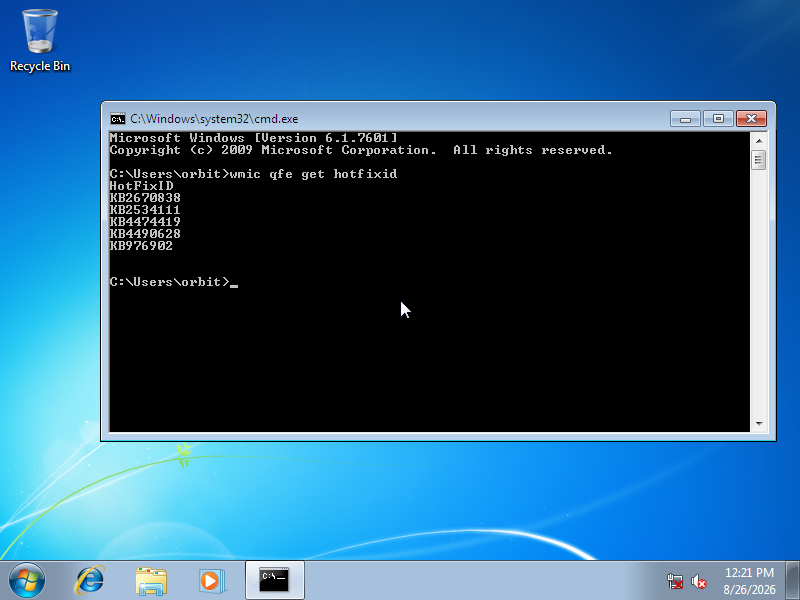
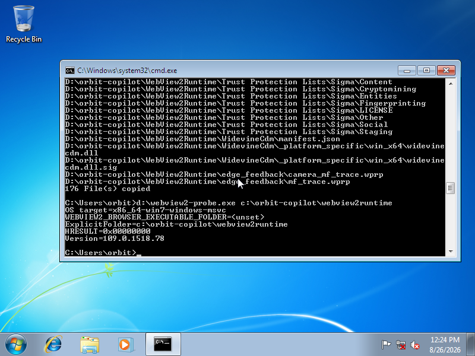
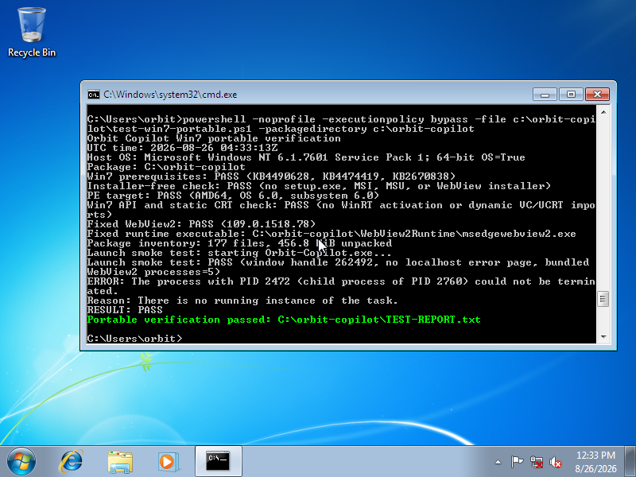
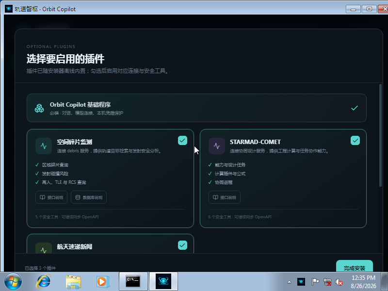

# Windows 7 SP1 x64 绿色版虚拟机验收报告

验收日期：2026-08-26

## 结论

Orbit Copilot `0.4.4` 绿色版已在无网络设备的标准 Windows 7 Enterprise SP1 64 位虚拟机中通过运行验收。应用不执行安装程序，不安装或注册系统级 WebView2；主窗口成功显示内置的插件选择页面，WebView2 子进程全部来自绿色包相邻的 `WebView2Runtime` 目录。

## 测试环境与介质

- 虚拟机：QEMU 4.2.1，TCG 软件虚拟化，4 GiB 内存，2 vCPU，标准 VGA；启动参数使用 `-net none`，QEMU `info network` 无任何网络设备。
- 操作系统：Microsoft Windows NT `6.1.7601 Service Pack 1`，Windows 7 Enterprise SP1 x64。
- 原版 ISO：`en_windows_7_enterprise_with_sp1_x64_dvd_u_677651.iso`。
- ISO 大小：`3182604288` 字节。
- ISO SHA-1：`a491f985dccfb5863f31b728dddbedb2ff4df8d1`，与微软支持文档公布值一致。
- ISO SHA-256：`ee69f3e9b86ff973f632db8e01700c5724ef78420b175d25bae6ead90f6805a7`。

虚拟机和所有大文件均创建在 `/mnt/data`，没有占用容量紧张的系统盘。测试账户、密码和虚拟磁盘仅用于本地离线兼容性验收，不属于发布包。

## 系统前置更新

从微软更新服务器取得并校验以下 x64 MSU，依次安装且每项完成后重启：

| 更新 | SHA-256 | QFE 结果 |
| --- | --- | --- |
| `KB4490628` | `8075f6d889bcb27be6f52ed47081675e5bb8a5390f2f5bfe4ec27a2bb70cbf5e` | 已登记 |
| `KB4474419-v3` | `99312df792b376f02e25607d2eb3355725c47d124d8da253193195515fe90213` | 已登记为 `KB4474419` |
| `KB2670838` | `9fe71e7dcd2280ce323880b075ade6e56c49b68fc702a9b4c0a635f0f1fb9db8` | 已登记 |

最终执行 `wmic qfe get hotfixid`，三项均出现在系统清单中。



## WebView2 来源校验

- Fixed Version Runtime：`109.0.1518.78 x64`。
- CAB SHA-256：`7622281cf83de1a35e3a471f432f7a897d65f0a7d3975df08512b7b253dd45c7`。
- `msedgewebview2.exe` SHA-256：`9364cd6ccbfef45127ebeb94846d65275251eb834b8e6e1b373396eb82ffd664`。
- `msedge.dll` SHA-256：`0a82741bd94f960423c7ecc06429fbeb594b3fe950f15054bf4ffab00e57cae8`。
- `EmbeddedBrowserWebView.dll` SHA-256：`fdeda2d46f70c3f527ee9bcb9c5e1805b7bbe344711c5750aa463f6fad61923f`。
- 上述三个核心 PE 的摘要和 Authenticode 均验证成功，签发者为 `Microsoft Corporation`。
- 静态 Loader：Microsoft WebView2 SDK `1.0.1518.46`，NuGet SHA-256 `63020b2d569d09a2098ae1ca20dd4cc281885f794aa00fc8812c6ab52dd49618`。

独立 `webview2_probe.exe` 在目标虚拟机对 `C:\Orbit-Copilot\WebView2Runtime` 的实际返回：

```text
HRESULT=0x00000000
Version=109.0.1518.78
```



## 最终程序检查

- `Orbit-Copilot.exe` SHA-256：`fba946018a8eeef70f3841529b48079463ae31e8831f7ac2090c9acc8d0d4e15`。
- PE：AMD64，OS `6.0`，subsystem `6.0`。
- 导入检查：无 WinRT 激活、`EventSetInformation`、`VCRUNTIME140.dll`、`MSVCP140.dll` 或动态 `ucrtbase.dll`。
- 包结构：无 `setup.exe`、MSI、MSU 或 WebView2 安装器。
- 主窗口：成功显示 Orbit Copilot 插件选择页面。
- 浏览器进程：自检检测到 5 个 `msedgewebview2.exe` 子进程，均来自 `C:\Orbit-Copilot\WebView2Runtime`。
- 运行过程：虚拟机无网络设备；WebView2 和页面资源均从绿色包本地加载。

最终 `TEST-WIN7-PORTABLE.ps1` 结果：

```text
Win7 prerequisites: PASS (KB4490628, KB4474419, KB2670838)
Installer-free check: PASS
PE target: PASS (AMD64, OS 6.0, subsystem 6.0)
Win7 API and static CRT check: PASS
Fixed WebView2: PASS (109.0.1518.78)
Launch smoke test: PASS (no localhost error page, bundled WebView2 processes=5)
RESULT: PASS
```





## 发现并修正的问题

第一次直接使用 Cargo/xwin 编译时，窗口和 WebView2 进程都能创建，但页面实际指向 Tauri 的开发地址并显示 `localhost refused`。原来的冒烟测试只检查窗口句柄和进程路径，因此产生假阳性。

修正措施：

1. Win7 目标在 `Cargo.toml` 中强制启用 Tauri `custom-protocol`，即使直接运行 Cargo/xwin 也会嵌入生产页面资源。
2. 绿色包自检读取 UI Automation 树；发现 `localhost refused`、`can't reach this page` 或 `ERR_CONNECTION_REFUSED` 时立即失败。
3. 修正后重新编译、覆盖虚拟机中的候选程序，重新执行完整自检并手动确认插件选择页面。

精简的 Windows Embedded Standard 7 镜像即使安装上述三项更新，Loader 探针仍返回 `0x80070032`。因此该精简镜像只保留为负向诊断证据，最终通过结论仅基于微软哈希可核验的完整 Windows 7 Enterprise SP1 x64。
